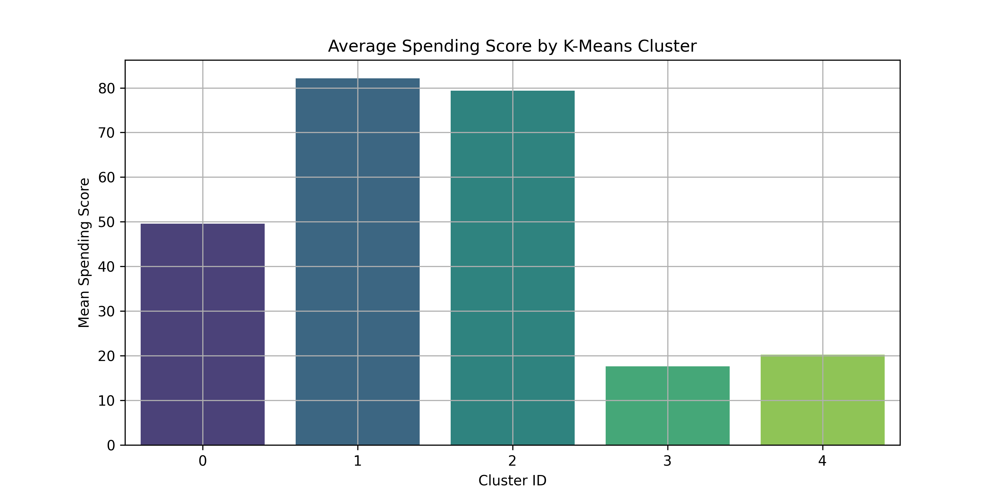
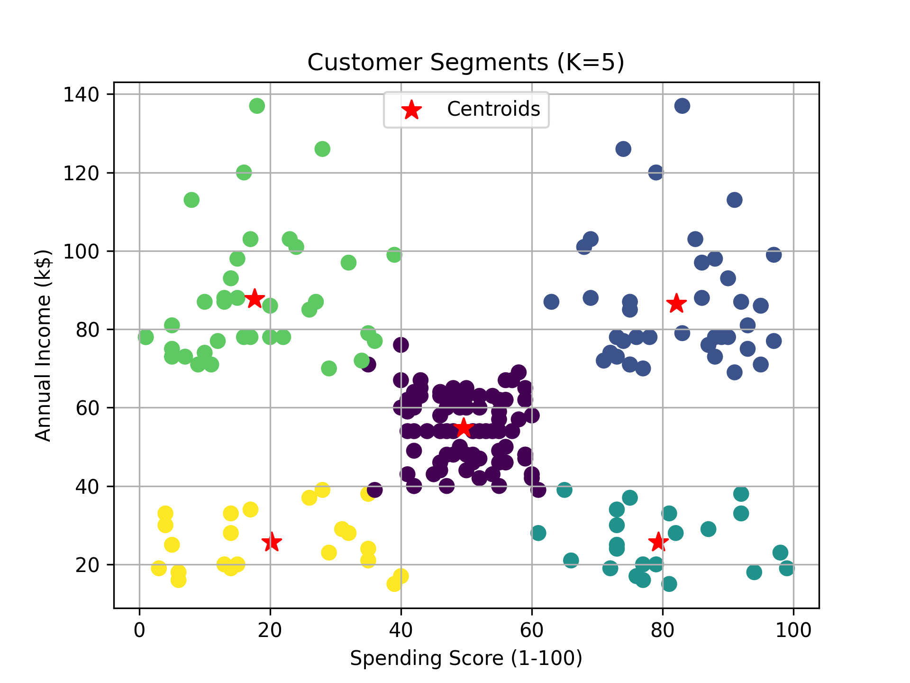

# Customer Segmentation using Clustering
**Unsupervised Machine Learning Case Study | Elevvo ML Internship**

[](https://www.python.org/)
[](https://scikit-learn.org/)
[](#)
[](#)

---

## Table of Contents
1. [Business Context](#business-context--problem-statement)
2. [Repository Structure](#repository-structure)
3. [Dataset Overview](#dataset-overview)
4. [Methodology](#methodology--workflow)
5. [Evaluation & Analysis](#evaluation--analysis)
6. [Results](#results-summary)
7. [Key Insights](#key-insights--business-interpretation)
8. [Tools & Technologies](#tools--technologies)
9. [How to Run](#how-to-run-the-project)
11. [Author](#author)
12. [License](#license)

---

## Business Context & Problem Statement

Retail businesses need to understand their customer base to:

- Segment customers for targeted marketing  
- Optimize product recommendations  
- Increase customer lifetime value  

The goal of this project is to **cluster mall customers** based on **Annual Income** and **Spending Score** using **K-Means clustering**, and explore **DBSCAN** as an alternative unsupervised learning technique.

This project was completed as part of my **Machine Learning Internship at Elevvo**.

---

## Repository Structure
```
Task-2-Customer-Segmentation/
│── data/
│   └── Mall_Customers.csv
│── notebooks/
│   └── customer_segmentation.ipynb
│── visuals/
│   ├── elbow_method_plot.png
│   ├── customer_segments_KMeans_5.png
│   ├── K_Distance_plot_for_DBSCAN.png
│   ├── DBSCAN_clusters_eps_0.12_min_samples_4.png
│   ├── average_spending_score_by_KMeans_cluster.png
│   ├── average_spending_score_by_DBSCAN_cluster.png
│── README.md
```
---

## Dataset Overview
- **Source**: [Mall Customers Dataset (Kaggle)](https://www.kaggle.com/datasets/vjchoudhary7/customer-segmentation-tutorial)
- **File**: `Mall_Customers.csv`
- **Features**:
  - `CustomerID`
  - `Gender`
  - `Age`
  - `Annual Income (k$)`
  - `Spending Score (1-100)`
- **Target:** Unsupervised – no explicit target variable  
- **Size:** 200 entries  

**Challenge:** Identifying meaningful clusters while handling scale differences between features.

---

## Methodology & Workflow

### Data Preprocessing
- Checked for missing values → dataset complete  
- Feature selection: Annual Income & Spending Score  
- Scaled features using **MinMaxScaler** for clustering stability

### Exploratory Data Analysis (EDA)
- Scatter plots: Income vs Spending Score  
- Visualization of feature distributions  

### Clustering
1. **K-Means Clustering**
   - Optimal clusters determined using **Elbow Method**  
   - Visualized clusters in 2D space with centroids  
2. **DBSCAN Clustering (Bonus)**
   - Determined `eps` using K-Distance plot  
   - Applied DBSCAN and compared results with K-Means  

### Cluster Analysis
- Computed **average spending score per cluster**  
- Visualized cluster-level spending patterns  

---

## Evaluation & Analysis

- **K-Means** formed **5 distinct clusters**:
  - Cluster 0: Medium income, medium spending  
  - Cluster 1: High income, high spending  
  - Cluster 2: High income, medium-high spending  
  - Cluster 3: Low income, low spending  
  - Cluster 4: Low income, low-medium spending

- **DBSCAN** identified **2 main clusters + noise** (8 customers treated as outliers)  

**Visual Insights:**  
- K-Means provides clear, business-friendly segments  
- DBSCAN useful for anomaly detection (noise/outliers)

---

## Results Summary

| Model      | #Clusters | Notes |
|------------|-----------|-------|
| K-Means    | 5         | Clear segmentation for targeted marketing |
| DBSCAN     | 2 (+ noise) | Useful for detecting outliers and irregular customers |

**Average Spending per Cluster (K-Means):**



**Cluster Visualization:**



---

## Key Insights & Business Interpretation

- Customers can be **effectively segmented** using only income & spending  
- High-value segments (high income + high spending) can be targeted for **premium campaigns**  
- Low-income low-spending clusters indicate potential for **promotion-driven engagement**  
- DBSCAN highlights **outliers**, useful for anomaly or VIP customer detection  

> This segmentation can directly inform marketing, product, and pricing strategies.

---

## Tools & Technologies

- Python  
- Pandas, NumPy  
- Matplotlib, Seaborn  
- Scikit-learn (KMeans, DBSCAN, MinMaxScaler)

---

## How to Run the Project
1. Clone this repository:
   ```bash
   git clone https://github.com/x3loox/Elevvo-Machine-Learning-Intern/blob/main/Task-2-Customer-Segmentation.git
   cd Task-2-Customer-Segmentation
   ```
2. Install dependencies:
   ```bash
   pip install -r requirements.txt
   ```
3. Run the Jupyter Notebook:
   ```bash
   jupyter notebook notebooks/customer_segmentation.ipynb
   ```

---

## Author
**AlaEldin Ali**  

_Data Science Enthusiast | ML Intern @ Elevvo_  

🔗 [LinkedIn](https://www.linkedin.com/in/x3loox) | [GitHub](https://github.com/x3loox)

---

## License
This project is for **educational purposes** as part of the **Elevvo Pathways Machine Learning Internship**.
